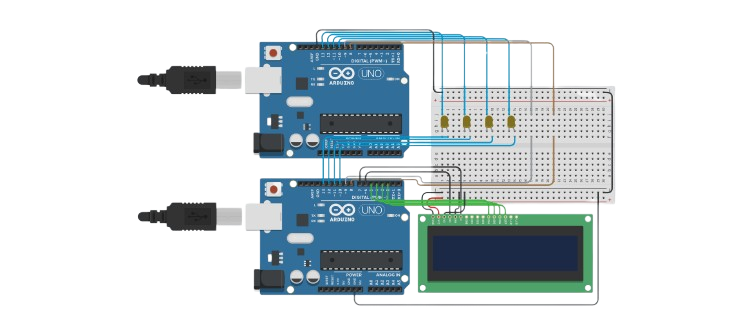

# 📘 **Trasmissione Asincrona parallela**
*Trasmissione Asincrona parallela tra due arduino via seriale*

---

## 👥 Realizzatori

| Realizzatori | 
|--------------|
|     **Riccardo Tonini** |
|     **Scattolin Tommaso** |

---

# 📑 Indice
- [1. Obiettivo](#1-obiettivo)
- [2. Foto](#2-foto)
  - [2.1 Thinkercad](#21-thinkercad)
  - [2.2 Circuito Fisico](#22-circuito-fisico)
- [3. Cenni Teorici](#3-cenni-teorici)
- [4. File Presenti](#4-file-presenti)
- [5. Conclusione](#5-conclusione)

---

## 1. **Obiettivo**
*(descrivere l’obiettivo dell’esperienza)*  

Puoi evidenziare concetti importanti con:  
- **grassetto** → `**testo**`  
- colore → `testo colorato`  
- entrambi → `<b>testo in grassetto e rosso</b>`

---

## 2. **Foto**

### 2.1 **Thinkercad**

### 2.2 **Circuito Fisico**

## 3 **CENNI TEORICI**

### Segnali digitali

> I segnali digitali sono impulsi elettrici che possono assumere solo due stati distinti, generalmente chiamati `HIGH` e `LOW`, corrispondenti a `5V` e `0V` su Arduino. Questo tipo di segnale permette di rappresentare informazioni in `forma binaria`, cioè 1 e 0, rendendolo ideale per i circuiti logici e i sistemi di controllo. 

> Su Arduino, i segnali digitali vengono utilizzati sia in input, per leggere lo stato di `pulsanti` o `sensori`, sia in output, per comandare `LED`, `motori` o altri dispositivi. La precisione del segnale digitale rende semplice gestire la logica dei programmi e sincronizzare l’interazione con il mondo esterno.

### Input e Output

> Arduino permette di gestire i segnali digitali attraverso i suoi pin, che possono essere configurati come input o output. I pin configurati come output possono inviare tensione al mondo esterno, ad esempio per accendere un LED o attivare un relè. Per fare questo si utilizza il comando `digitalWrite`, che permette di impostare il pin su HIGH (5V) o LOW (0V).

> I pin configurati come input servono invece a leggere segnali provenienti da sensori, pulsanti o interruttori. In questo caso si utilizza il comando `digitalRead`, che restituisce lo stato del pin, HIGH o LOW, a seconda della tensione presente. La configurazione dei pin si fa con `pinMode`, specificando se il pin deve comportarsi come INPUT o OUTPUT.

> Su una scheda Arduino UNO, i pin digitali vanno da `D0` a `D13`, e alcuni di essi hanno funzioni speciali come `PWM` o comunicazione seriale (`TX` e `RX`). L’uso corretto dei pin in input e output permette ad Arduino di interagire con il mondo esterno, ricevendo informazioni dai sensori e controllando dispositivi.

### Protocollo di handshake

> Il protocollo di handshake è un `metodo di comunicazione` che permette a due dispositivi di `sincronizzarsi prima di scambiare dati`. In pratica, un dispositivo segnala quando è `pronto a inviare o ricevere informazioni`, e `l’altro conferma quando è pronto a riceverle o a prenderle in carico`, evitando perdite o errori nei dati.

> Su Arduino, l’handshake digitale può essere implementato con pin configurati come input e output, dove `segnali HIGH e LOW indicano lo stato di “pronto” o “ricevuto”`. Questo tipo di protocollo è molto utile quando si devono trasferire dati tra più Arduino o Arduino e altri dispositivi in modo affidabile.

## 4 **FILE PRESENTI**
Elenco dei file inclusi nel progetto (aggiornare in base alla cartella):

/src → codici  
/schematic → schema elettrico mediante KiCAD
/images → immagini utilizzate nel README
README.md → file descrittivo

## 5. **Conclusione**
*(risultati ottenuti, osservazioni, problemi riscontrati, possibili sviluppi futuri)*
